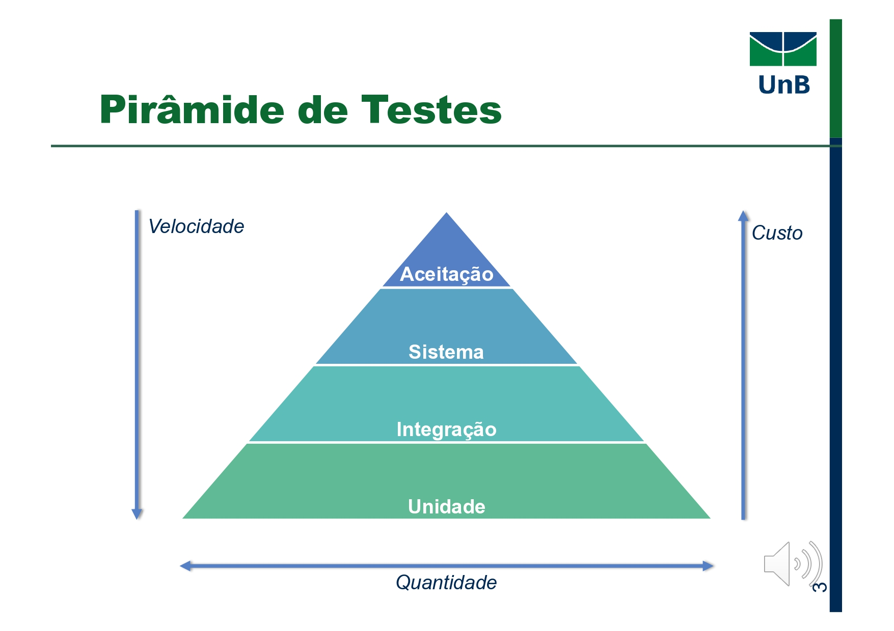
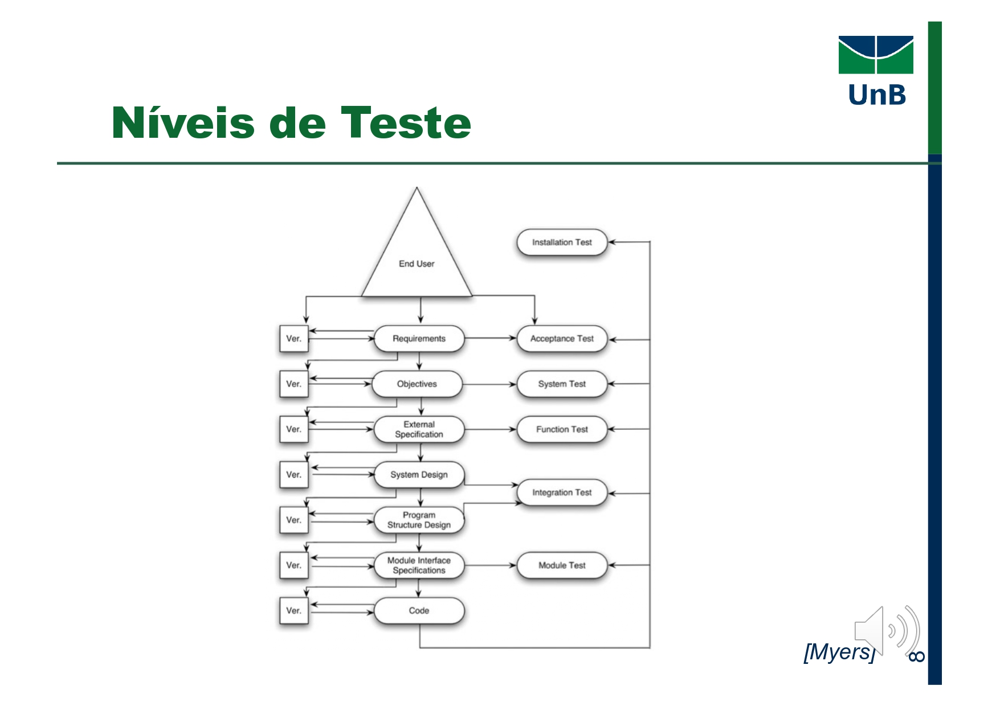

## 3. Pirâmide de Testes

A **Pirâmide de Testes** ilustra como equilibrar velocidade, custo e cobertura ao estruturar sua suíte de testes (Meszaros, 2007):



| Nível       | Quantidade de Testes | Custo por Teste | Velocidade de Execução | Exemplos de Ferramentas          |
|-------------|----------------------|-----------------|------------------------|----------------------------------|
| **Aceitação**   | Baixa                | Alto            | Muito Lenta            | Cucumber, Robot Framework        |
| **Sistema**     | Média                | Médio           | Lenta                  | Selenium, TestComplete           |
| **Integração**  | Média–Alta           | Baixo–Médio     | Moderada               | Pytest + Docker Compose, Postman |
| **Unidade**     | Alta                 | Baixo           | Muito Rápida           | pytest, unittest, Jest           |

- **Unidade (base)**  
  -  **O que:** Testes de função/método isolado.  
  -  **Por que:** Rápidos e baratos; detectam defeitos de lógica interna antes de integrar dependências.  
- **Integração (camada intermediária)**  
  -  **O que:** Testes de múltiplos módulos funcionando juntos (por exemplo, serviço + banco de dados).  
  -  **Por que:** Verifica contratos/interfaces, detecta erros de comunicação e configuração.  
- **Sistema (última camada antes da aceitação)**  
  -  **O que:** Testes fim-a-fim que exercitam todo o sistema em ambiente real ou simulado.  
  -  **Por que:** Confirma fluxo completo (UI → backend → DB), mas custa mais manter.  
- **Aceitação (topo)**  
  -  **O que:** Validação contra requisitos de negócio por meio de cenários escritos em linguagem natural.  
  -  **Por que:** Garante que o software atenda às expectativas do usuário, mas demora para rodar.

> **Eixos**  
> - **Velocidade**: decresce de unidades → aceitação.  
> - **Custo**: cresce de unidades → aceitação.  
> - **Quantidade**: cresce de aceitação → unidades.

---

## 4. Outros Formatos de Estratégia

### A. The Testing Trophy  
Desenvolvida por Kent C. Dodds para aplicações web modernas:


- **Static**: detecção de erros sem execução (ESLint, mypy).  
- **Unit**: lógica interna (Jest, pytest).  
- **Integration**: contratos entre módulos (Testing Library, pytest-docker).  
- **End to End**: simulação completa de usuário (Cypress, Playwright).  
> *Meta:* Keep static and unit tests em larga quantidade, reduzindo gradualmente até E2E (Dodds, 2020).

### B. Microservices Test Strategy  
Abordagem do Spotify Labs para arquiteturas de microsserviços:

1. **Implementation Detail**: validar lógica isolada de cada serviço (testes de unidade profundas).  
2. **Integration**: testar comunicação entre pares de serviços (contratos de API).  
3. **Integrated**: executar conjunto completo de microsserviços simulando produção (fluxos end-to-end).  
> *Recomendação:* minimizar testes de detalhe interno, focar em Integration e Integrated (Spotify Labs, 2019).

---

## 5. Níveis de Teste – Benefícios

1. **Evita redundância**  
   - Cada nível foca em diferentes categorias de defeitos (Myers et al., 2012).  
2. **Custo x Risco**  
   - Detectar cedo (unidade) corrige barato; detectar tarde (aceitação) corrige caro.  
3. **Escalabilidade**  
   - Pequenos projetos podem parar em integração; projetos críticos devem chegar à aceitação.  

---

## 6. Níveis de Teste – Considerações

- **Não são sequenciais:** escolha níveis conforme **risco**, **orçamento** e **complexidade** do projeto.  
- **Fatores a influenciar a estratégia:**  
  - Grau de acoplamento e coesão do sistema.  
  - Frequência de mudanças nos componentes.  
  - Recursos de infraestrutura (tempo de build, ambientes de teste).  

---

## 7. Diagrama de Correspondência de Níveis



## 8. Lista de Níveis de Teste

1. **Unidade** – testar o menor bloco de código isoladamente.  
2. **Integração** – validar a interação entre módulos.  
3. **Função** – foco em funcionalidades discretas, similar a testes de sistema menores.  
4. **Sistema** – testes de ponta a ponta num ambiente completo.  
5. **Aceitação** – validação contra critérios de aceite do cliente.

---

## 9. Testes de Unidade

**Definição (Myers, 2012):**  
Processo de testar funções, métodos, procedimentos, sub-rotinas ou subprogramas **individualmente**, garantindo que cada unidade isolada se comporte conforme a especificação.

- **Objetivo:** verificar o **menor elemento testável** de um software.  
  - Procedural: função ou procedimento.  
  - Orientado a objeto: método de classe.  
- **Responsável:** geralmente o **desenvolvedor**.  
- **Enfoque:** algoritmos e lógica de programação.  
- **Técnicas:** tipicamente **caixa-branca**, complementada por **caixa-preta**.

**Motivações:**  
- Gerenciar incrementalmente os elementos do teste.  
- Facilitar a **depuração** (localização de defeitos).  
- Permitir **paralelismo** na execução dos testes.

### 9.1. Ferramentas em Python

| Ferramenta    | Características                                         | Referência                                       |
|---------------|----------------------------------------------------------|--------------------------------------------------|
| `unittest`    | Framework padrão, estilo xUnit.                          | Python Software Foundation (2024).               |
| `pytest`      | Sintaxe concisa, fixtures, parametrização e plugins.     | pytest Documentation (2024).                     |
| `coverage.py` | Medição de cobertura de código.                          | Ned Batchelder (2024).                           |

### 9.2. Exemplo Simples: Função `is_even`

```python
# utils.py
def is_even(n: int) -> bool:
    """
    Retorna True se n for par, False caso contrário.
    """
    return n % 2 == 0
```

#### 9.2.1. Testes com `pytest`

```python
# tests/test_utils.py
import pytest
from utils import is_even

@pytest.mark.parametrize("input,expected", [
    (0, True),
    (1, False),
    (2, True),
    (99, False),
])
def test_is_even(input, expected):
    assert is_even(input) == expected
```

- **Casos de teste**:
  - `0` → `True`
  - `1` → `False`
  - `2` → `True`
  - `99` → `False`

#### 9.2.2. Teste Caixa-Branca (Cobertura de Decisão)

```python
def test_is_even_branches():
    # testa tanto o ramo True quanto o ramo False
    assert is_even(4) is True
    assert is_even(5) is False
```

- Com isso garantimos que ambas as saídas (`True` e `False`) ocorram ao menos uma vez.

---

### 9.3. Critérios de Cobertura

| Critério                | Descrição                                                           |
|-------------------------|---------------------------------------------------------------------|
| Cobertura de decisões   | Garante que `n % 2 == 0` avalie `True` e `False`                    |
| Cobertura de instruções | Garante execução da única linha da função                           |

```bash
# Gerando relatório de cobertura
coverage run -m pytest && coverage report -m
```

```text
Name           Stmts   Miss  Cover
----------------------------------
utils.py           3      0   100%
```

---

## 12. Referências Bibliográficas

- Myers, G. J., Sandler, C., & Badgett, T. (2012). _The Art of Software Testing_. John Wiley & Sons.  
- pytest Development Team. (2024). _pytest documentation_. Retrieved from https://docs.pytest.org/  
- Ned Batchelder. (2024). _coverage.py documentation_. Retrieved from https://coverage.readthedocs.io/  
- Meszaros, G. (2007). _xUnit Test Patterns: Refactoring Test Code_. Addison-Wesley.  
- Dodds, K. C. (2020). *The Testing Trophy*.  
- Spotify Labs. (2019). *Microservices Test Strategy*